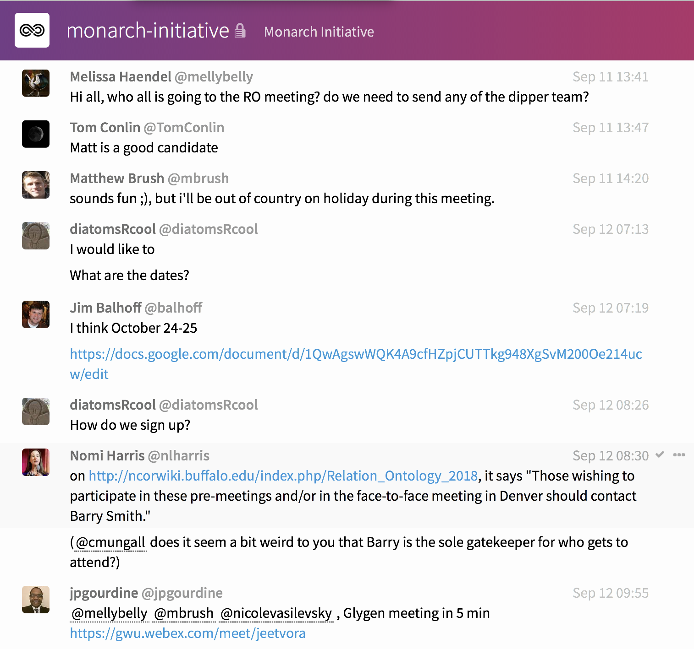
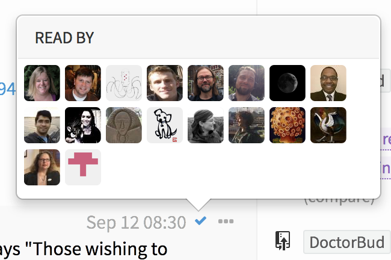

## Lesson 4: Survival strategies for team communication
##### [Back to Home](../index.md)

### Overview
- [Communication considerations](#communication)
- [Gitter](#gitter)
- [Slack](#slack)
- [Skype](#skype)
- [Zoom](#zoom)

### Communication considerations

#### 1. Set clear standards of communication

Depending on the type of work you do, a daily or even a couple of daily meetings might be required to ensure team cohesiveness. Mandy Brown, the CEO of Editorially, a collaborative writing platform that was bought by Vox Media last year, [advocates](http://stet.editorially.com/articles/making-remote-teams-work/) that remote teams overcommunicate on purpose. “On a remote team, opportunities for misunderstanding between teammates distributed across both time and geography magnify,” she wrote. Brown says one effective way to ensure communication is to record meetings so that anyone confused about what has transpired can go back and look at the record. While someone should always document the decisions and actions that result from a meeting, actual audio/video recording can be problematic and is not even always allowed in all contexts. Recording audio/visual should be limited to meetings where that is allowed, and where a key member is known to be missing and has indicated a willingness to listen to the recording. Communication is key to effectively leading remote and/or distributed teams. Setting up the standard for communication and requiring it be followed will be critical.

Many people like to have uninterrupted time to work by themselves; this is especially true of programmers. Overcommunicating on purpose -- if it leads to a proliferation of meetings -- can backfire for team productivity, not to mention morale. Instead of first resorting to *more* communication, focus on improving the clarity of your communication with "progressive disclosure"; allowing ways for people to dive deeper should they choose to. 

#### 2. Experiment small and scale up to the whole team

When asking the whole team to do a new kind of task, ask one person or a handful of other people if the request is clear. You may not want to pilot your requests with the team member who is always complaining; however, sometimes this makes sense. If the sticky wicket can help identify a lack of clarity, diffuse purpose etc. it can save the whole team time and work more effectively. The bigger your team is, the more important this step is. Even when rolling out more broadly, it can be useful to describe new approaches as experiments. This leaves the door open for tweaking the approach. Keep in mind that there is nothing (!) that will please everyone. Accept that there's always going to be someone on the team with a peculiar suggestion that won't work for anyone but them.

#### 3. When it comes to centralizing comms, pick your battles

Some things are better communicated in person or by team leads rather than by a centralized email. Pick your worst critic or most disinterested person. Read the email through that person’s eyes. Then make the decision. If you do decide to federate the messaging, give the leads a head start with fodder so that the message gets through clearly.

#### 4. Know what tools to use for what sorts of communications

Great summary here: [https://blog.discourse.org/2018/04/effectively-using-discourse-together-with-group-chat/](https://blog.discourse.org/2018/04/effectively-using-discourse-together-with-group-chat/)

Chat is great for the kinds of ephemeral / transactional conversations that do not need to be saved. Chat is very information dense: it omits all the email headers, verbose signatures, quoted text repeats, and gratuitous whitespace. As a result, it takes less time and effort to skim a thread than it would a similar email thread. As with email, this does NOT mean that anyone should read every message as it comes in; or even that anyone should read all the messages they're not mentioned on.

Gitter and Skype also offer read receipts which can be helpful for announcements.

#### 5. Know what to look for in terms of growing pains

Projects that start off big or grow fast have an especially challenging task. Beyond a certain point, things just fall apart. Pick your battles; then once you have, pick which of those to centralize and which to federate. Revisit the battle selection periodically.

### Gitter

[Gitter](https://gitter.im/) is a chat platform that is linked your github account, and can be used for individuals and teams to chat/instant message. Its strength is that it has good integration with GitHub and the content you put in is yours (and can be gotten out as text if the platform were to go commercial).

**Start using Gitter**

- Go to the [gitter website](https://gitter.im/tis-lab/MTIP-tutorial?utm_source=share-link&utm_medium=link&utm_campaign=share-link)
- Click on the top right SIGN IN TO START TALKING
- Sign in with GitHub
- Click on the mangifying glass on the left hand side to search
- Search for MTIP-tutorial
- Click on the room and join the chat

Note - you can also download gitter to your desktop and chat through the app

### Slack

[Slack](https://slack.com/) is another chat platform that is independent of your GitHub account, and can also be used by individuals or teams to chat and instant message. Its strength is that anyone on a project can create a "channel" with focused conversation about a particular topic. For a head to head critique of Gitter vs Slack, see [here](https://www.quora.com/What-are-the-pros-and-cons-of-Gitter-vs-Slack).

### Skype
Skype's strength over Slack and Gitter is that it is completely decentralized. Consequently, it is easier to convene chat or voice communication in an ad-hoc manner across teams/projects as needed. While not everyone uses Skype regularly, virtually everyone has a Skype account and it is free. You can also set up Skype-In numbers (useful for remote workers). Note that "Skype for Business" is not the same as plain ol' Skype; Skype for Business, actually has more headaches and offers less flexibility than does its free rival.

### Zoom
While you are on a zoom call, you can message the participants, however, the history is not preserved between sessions in the same room. It is not even visible to new participants who arrive late to the call. There's no way to use the chat feature outside of an active meeting. If you want the chat history to be preserved during a call, you'll need a different mechanism that is persistent.

##### [Click here for Lesson 5](https://data2health.github.io/mtip-tutorial/lessons/Lesson5.html) 
### [Back to Home](../index)
